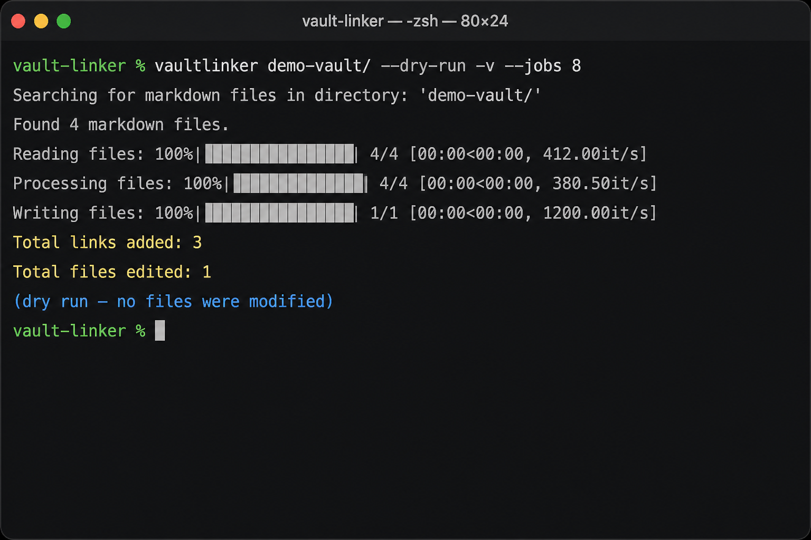
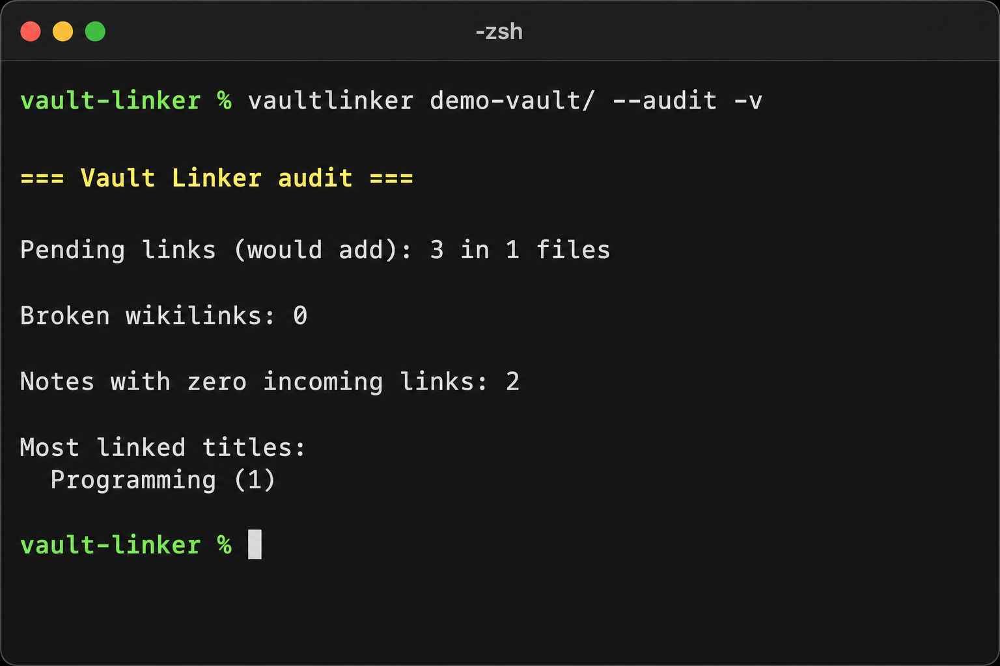
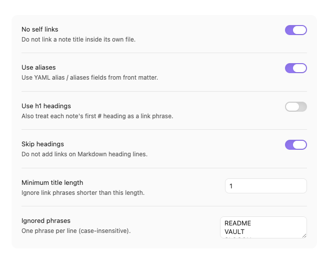

# Vault Linker

[](https://github.com/arshad115/vault-linker/actions/workflows/run-tests.yml)
[](https://pypi.org/project/vaultlinker/)

## Overview

Vault Linker links note titles and YAML aliases across your Obsidian vault as wikilinks. Use the **CLI** (`vaultlinker`) for batch jobs, parallelism, and automation, or the **community plugin** for link, audit, and unlink from inside Obsidian.

## Linking

<p float="left">
  
  
</p>

*Obsidian graph view before and after running Vault Linker on a vault (illustrative).*

## Features

- Automatic wikilinks for note titles and YAML aliases
- **Parallel runs** with `--jobs` (read / process / write phases)
- Dry-run, backup, output copy, globs, and incremental state
- **Audit** broken links, pending links, and backlink stats; **unlink** managed title links
- Skips metadata, code blocks, embeds, and markdown links (CLI + plugin)

## Linking Process

1. **Scan Files**: The tool scans all the markdown files in your Obsidian vault.
2. **Extract Filenames**: It extracts the filenames from the scanned files.
3. **Match Filenames**: It matches the filenames with the content in other files, ignoring the case.
4. **Insert Links**: When a match is found, it inserts a Wikilink in the content, preserving the original case of the filename in the link.
5. **Skip Metadata and Code**: The tool skips adding links in metadata sections and code blocks to avoid unwanted linking.

### Examples

- **Simple Linking**: If a file named `Object-Oriented Programming.md` exists and another file mentions "object-oriented programming", the tool will link it as `[[object-oriented programming]]`.
- **Preserve Case**: If the mention is "Object-Oriented Programming", the link will be `[[Object-Oriented Programming]]`.
- **No Links in Code Blocks**: Mentions inside code blocks are ignored.
- **No Links in Metadata**: Mentions inside metadata sections are ignored.
- **Multiple Links**: If multiple files are mentioned, each will be linked appropriately.
- **Partial Matches**: If a file named `Object.md` exists, mentions of "object" will be linked as `[[object]]`, but "objects" will not be linked.
- **Complex Linking**: If files named `Object-Oriented Programming.md`, `Functional Programming.md`, and `Object.md` exist, and another file mentions "object-oriented programming", "functional programming", and "object", each will be linked as `[[object-oriented programming]]`, `[[functional programming]]`, and `[[object]]` respectively. Note "object" will not be added inside "object-oriented programming".

## Installation

### From PyPI

Package: **[vaultlinker on PyPI](https://pypi.org/project/vaultlinker/)**

```sh
pip install vaultlinker
vaultlinker /path/to/vault/ --help
```

### From source

Clone the repository and install the package (recommended):

```sh
git clone https://github.com/arshad115/vault-linker.git
cd vault-linker
pip install -e ".[dev]"
```

For a quick script-only install without the console command:

```sh
pip install -r requirements.txt
```

## Usage



*`vaultlinker` dry run with verbose progress (`-v`) and eight workers (`--jobs 8`).*

After installation:

```sh
vaultlinker /path/to/vault/
```

Or run the module directly:

```sh
python vaultlinker.py /path/to/vault/
```

Use `-v` / `--verbose` for progress bars and scan details (default is quiet except warnings and the summary).

Parallel processing (read, link, and write phases):

```sh
vaultlinker /path/to/vault/ --jobs 8
vaultlinker /path/to/vault/ --jobs 0   # automatic worker count
```

### Safety options

Preview changes without writing files:

```sh
python vaultlinker.py /path/to/vault/ --dry-run
```

Write linked copies to another directory (vault files stay unchanged):

```sh
python vaultlinker.py /path/to/vault/ --output /path/to/linked-vault/
```

Create a `.bak` copy of each file before overwriting it in the vault:

```sh
python vaultlinker.py /path/to/vault/ --backup
```

Skip linking a note's title inside its own file (e.g. do not turn `README` into `[[README]]` in `README.md`):

```sh
python vaultlinker.py /path/to/vault/ --no-self-links
```

By default, markdown under `.obsidian`, `.git`, `attachments`, and similar folders is skipped. Add more directory names with `--exclude DIRNAME`, or pass `--no-default-excludes` to scan everything.

Limit which notes are processed with vault-relative globs:

```sh
vaultlinker /path/to/vault/ --include-glob 'notes/**' --exclude-glob 'templates/**'
```

### Obsidian-aware linking

- **Aliases**: YAML `alias` / `aliases` in front matter are link phrases; matches use `[[Note Title|alias]]` when the visible text differs from the note title.
- **Embeds & markdown links**: Text inside `![[...]]` and `[label](url)` is not linked.
- **Headings**: Text on `# heading` lines is skipped unless you pass `--link-headings`.
- **Duplicate filenames**: If two notes share the same filename in different folders, the tool warns and uses the note with the longest path as the link target for that title.
- **`--use-headings`**: Also link phrases taken from each note's first `# H1` heading.
- **`--no-aliases`**: Only use filenames, not front matter aliases.

### Audit and unlink



Audit the vault (no file changes):

```sh
vaultlinker /path/to/vault/ --audit
vaultlinker /path/to/vault/ --audit -v   # include pending link details
```

Reports pending links (same rules as a dry run), broken `[[wikilinks]]` with no matching note, notes with zero incoming links, and the most-linked titles.

Remove wikilinks that this tool would create (title and alias forms only; manual links to other targets are kept):

```sh
vaultlinker /path/to/vault/ --unlink --dry-run
vaultlinker /path/to/vault/ --unlink --backup
```

### Incremental and blocklist

Re-run only notes that changed since the last successful incremental run (state is stored in `.obsidian/vault-linker-state.json`). If notes are added or removed, every note is processed again so new titles can link correctly.

```sh
vaultlinker /path/to/vault/ --incremental
```

Skip noisy short titles or specific words:

```sh
vaultlinker /path/to/vault/ --ignore-phrase README --min-title-length 4
vaultlinker /path/to/vault/ --ignore-file ./linker-ignore.txt
```

## Obsidian plugin

Install **Vault Linker** from **Settings → Community plugins**, or build from [`plugin/`](plugin/) (source). Release assets (`manifest.json`, `versions.json`, `main.js`) live at the **repo root** for Obsidian’s directory scanner.



See [plugin/README.md](plugin/README.md) and [PUBLISHING.md](PUBLISHING.md).

Make sure to back up your vault before using this tool, as in-place runs can make irreversible edits unless you use `--dry-run` or `--output`.
## Running Tests

To run tests for Vault Linker, use the following command:
```sh
pytest
```

This will execute all the tests and provide you with a summary of the results. Make sure you have all the necessary dependencies installed before running the tests.

## TODO

- [x] Add support for alias links
- [x] Multithreading
- [ ] Write additional tests for edge cases
- [x] Make it into a plugin for Obsidian

## Contributors

- [Arshad Mehmood](https://github.com/arshad115)

## Contributing

We welcome contributions to Vault Linker! If you have an idea for a new feature or have found a bug, please open an issue or submit a pull request.

### Steps to Contribute

1. Fork the repository.
2. Create a new branch for your feature or bugfix:
    ```sh
    git checkout -b feature-name
    ```
3. Make your changes and commit them:
    ```sh
    git commit -m "Description of your changes"
    ```
4. Push your changes to your fork:
    ```sh
    git push origin feature-name
    ```
5. Open a pull request on the main repository.

## License

This project is licensed under the MIT License. See the [LICENSE](LICENSE) file for more details. © Arshad Mehmood


